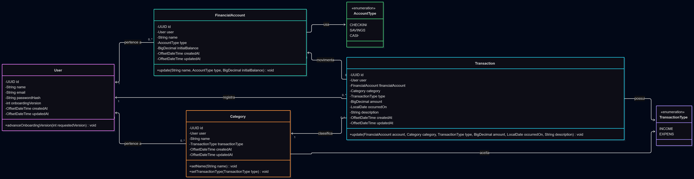
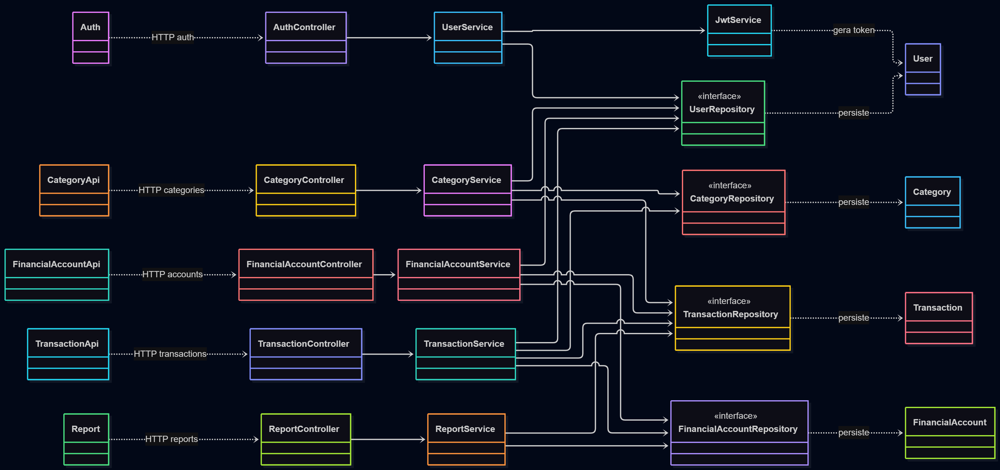
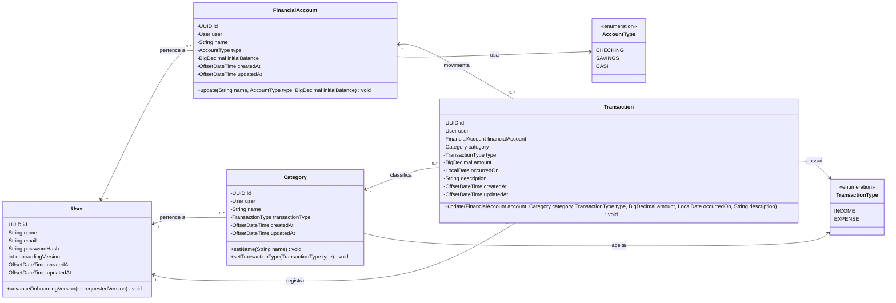
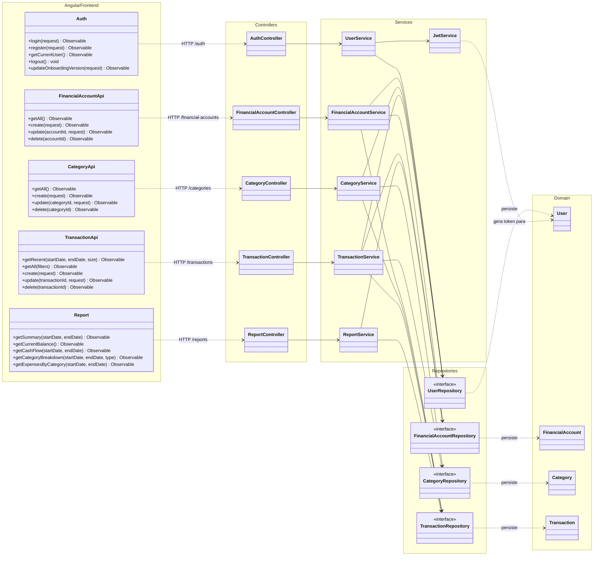

# Diagrama de classes — Finance Manager

Este documento representa as classes centrais encontradas no backend Spring Boot e os clientes de API do frontend Angular. Para manter a leitura clara, DTOs, exceções, configurações e componentes visuais foram resumidos nas fronteiras das camadas.

Os arquivos Mermaid sem marcações Markdown, prontos para importação no Mermaid Live Editor, estão em [`diagrama-dominio.mmd`](diagrama-dominio.mmd) e [`diagrama-arquitetura.mmd`](diagrama-arquitetura.mmd).

## Diagramas renderizados

### Modelo de domínio

### Arquitetura da aplicação

## Fontes editáveis

### Modelo de domínio

### Camadas e dependências

## Leitura rápida

- `User` é o agregado proprietário dos dados financeiros.
- Cada `Transaction` pertence a exatamente um usuário, uma conta e uma categoria.
- O tipo da transação deve coincidir com o `TransactionType` da categoria.
- Controllers expõem a API REST, services aplicam regras de negócio e repositories cuidam da persistência.
- Os serviços Angular espelham os cinco grupos de endpoints do backend.
